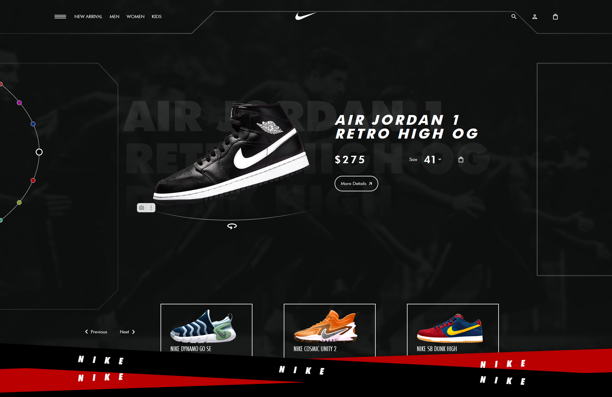

  

  Один из первых проектов которые были сделаны в процессе обучения
  
<b>демо:</b> <a href="https://mushketov.github.io/Nike/" target="_blank">Nike</a> (не доделан)

  
<b>макет:</b> <a href="https://www.figma.com/file/GaReAIzXEfEVv1inLErLmo/AdnanNikeWebsite?type=design&node-id=0-1&mode=design">figma.com</a>

  <b>stack:</b>
  <ul>
    <li>html</li>
    <li>scss</li>
    <li>swiperjs</li>
  </ul>
